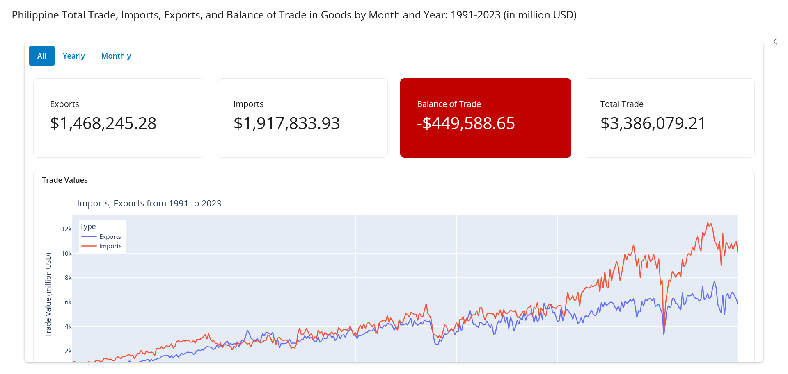
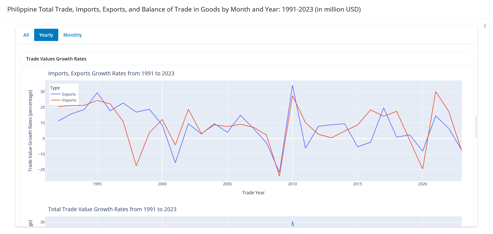
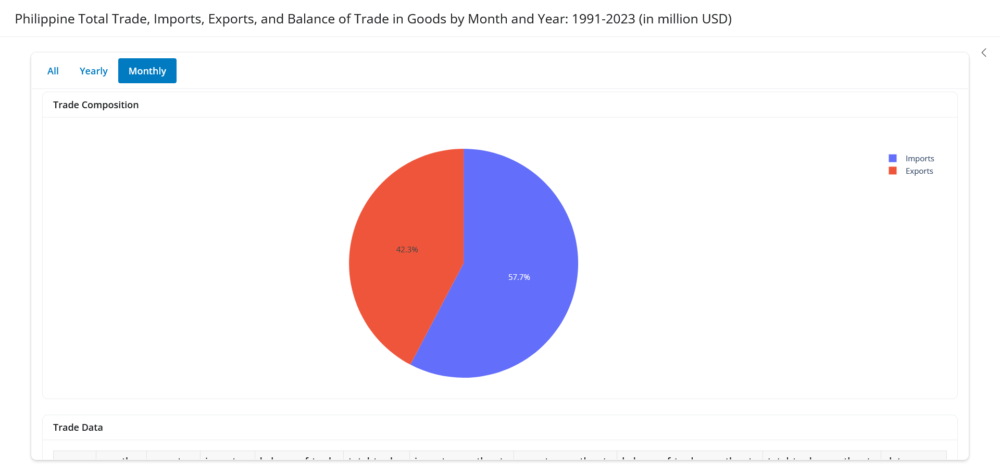
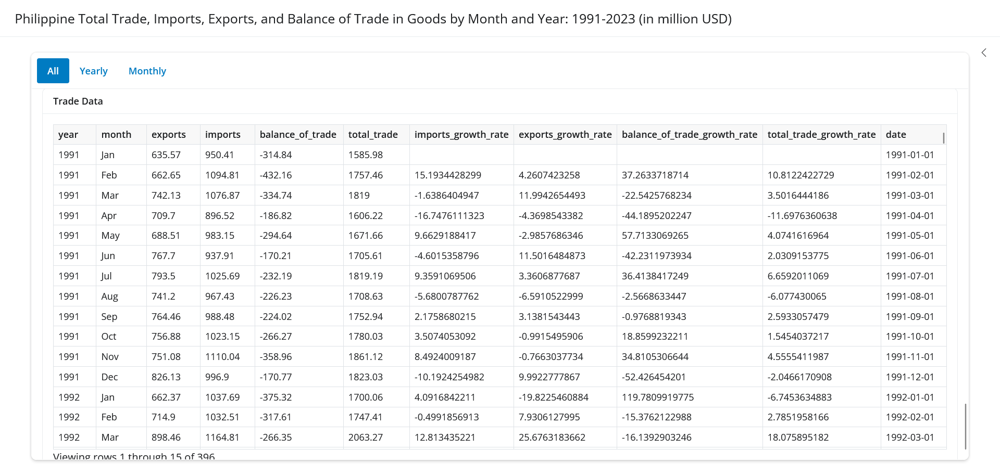

# Philippine Total Trade, Imports, Exports, and Balance of Trade in Goods by Month and Year: 1991-2023*

* *Partial data from 2024 is not included

## Screenshots

**Trade Summary**

**Trade Growth Rates**

**Trade Compsition**

**Trade Values**

### Balance of Trade Growth Rates

It is essential to compare the actual two values (current & previous) instead of purely relying on the given *growth rate*.

The percentage changes are computed using [pandas.Series.pct_change](https://pandas.pydata.org/docs/reference/api/pandas.Series.pct_change.html)

Correct interpretation as follows:

> tl;dr;

| If the Previous Value is ... | and the Current Value is ... | there was a/an ... | Example    |
| ---------------------------- | ---------------------------- | ------------------ | ---------- |
| Smaller Positive             | Bigger Positive              | increase           | 10 -> 20   |
| Bigger Negative              | Smaller Negative             | increase           | -20 -> -10 |
| Negative                     | Positive                     | increase           | -10 -> 10  |
| Bigger Positive              | Smaller Positive             | decrease           | 20 -> 10   |
| Positive                     | Negative                     | decrease           | 10 -> -10  |
| Smaller Negative             | Bigger Negative              | decrease           | -10 -> -20 |

Details below:

1. Smaller Positive (previous value) -> Bigger Positive (current value)
   - July 1998's balance of trade is 128.83
   - August 1998's balance of trade is 35.78
   - The computed growth rate is -72.22, which must be interpreted as
   - There was a 72.22 percent **increase** between July and August 1998's balance of trades.
2. Negative -> Positive
   - 1998's balance of trade is -163.54
   - 1999's balance of trade is 4294.45
   - The computed growth rate is -2725.93, which must be interpreted as
   - There was a 2725.93 percent **increase** between 1998 and 1999's balance of trades.
3. Bigger Negative -> Smaller Negative
   - January 1997's balance of trade is -1145.63
   - February 1997's balance of trade is -814.12
   - The computed growth rate is -28.94, which must be interpreted as
   - There was a 28.94 percent **increase** between January and February 1997's balance of trades.
4. Bigger Positive -> Smaller Positive
   - December 1998's balance of trade is 461.47
   - January 1999's balance of trade is 180.93
   - The computed growth rate is -60.79, which must be interpreted as
   - There was a 60.70.24 percent **decrease** between December 1998 and January 1999's balance of trades.
5. Positive -> Negative
   - March 1999's balance of trade is 46.03
   - April 1999's balance of trade is -253.26
   - The computed growth rate is -650.21, which must be interpreted as
   - There was a 650.21 percent **decrease** between March and April 1999's balance of trades.
6. Smaller Negative -> Bigger Negative
   - 2002's balance of trade is -4028.36
   - 2003's balance of trade is -4239.33
   - The computed growth rate is 5.24, which must be interpreted as
   - There was a 5.24 percent **decrease** between 2002 and 2003's balance of trades.

### References

* [Highlights of the Philippine Export and Import](https://psa.gov.ph/statistics/export-import/monthly)

### Data

* https://openstat.psa.gov.ph/International-Merchandise-Trade-Statistics-IMTS